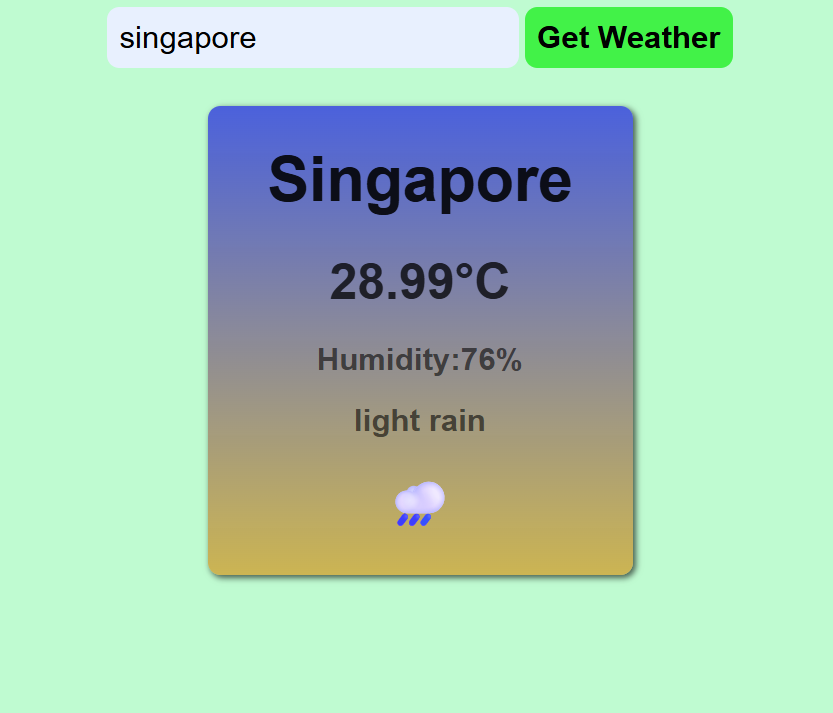

# WEATHER_APP
This is a Weather app created by using html ,css ,javascript with a free APIKEY from openweathermap.org .

**The demo will look like:**  

# Steps to follow :
1) search openweathermap.org in your browser then create a account using gmail for free. 
2) Go to My Api Keys section , you will get default apikey.
3) Make sure the apikey should be active.
4) clone this repository.
5) paste your API KEY in apiurl inside javascript file.